# Notebook
This document contains notes taken during the design of the software and circuitry of the Light Wand project.

## 2024/02/17

Testing what acceleration level needs to be selected on the ADXL343 for rapidly waving the stick to not max it out.

- Range = 4G. Gravity = 128. MaxVal = 512
- Range = 8G. Gravity = 64. MaxVal = 511
- Range = 16G. Gravity = 32. MaxVal = 275

Because 8G maxxes out, it looks like we will need to use the 16G setting. However, it is not impossible that the 8G setting will turn out to be a better fit. When waving the stick at more reasonable speeds, the 16G max value was more like 200

## 2024/02/18

### Boost Converter Component selection

Lets look at the MT3608 boost converter ([Datasheet](https://www.olimex.com/Products/Breadboarding/BB-PWR-3608/resources/MT3608.pdf)). We need it to step up the battery voltage to the required 5V. The boost converter needs some supporting components: A schotkey diode, an inductor, and some caps/resistors as shown in Figure 1 on the datasheet.

To properly select the inductor and diode, we need to find the peak current through the inductor, also known as the maximum switch current. First, we'll find the duty cycle for our application following the TI guide [Basic Calculation of a Boost Converter's Power Stage](https://www.ti.com/lit/an/slva372d/slva372d.pdf?ts=1708242509978&ref_url=https%253A%252F%252Fwww.google.com%252F).

$$D = 1 - \frac{V_{IN(min)} * \eta}{V_{OUT}}$$

$$\Delta I_L = \frac{V_{IN(min)} * D}{f_S * L}$$

$$I_{OUT(max)} = (I_{LIM(min)} - \frac{\Delta I_L}{2}) * (1 - D)$$

Where $\eta = 0.8$ (worst case efficiency of the converter), $V_{IN(min)} = 2.5V$, $V_{OUT} = 5V$, $f_s = 1.2MHz$ as given by the datasheet, $ L = 22\mu H$ as given by the datasheet, and $I_{LIM(min)} = 4A$ as given by the datasheet.

Unfortunately, this results in a calculated maximum output current of $I_{OUT(max)} = 1.58A$, which is well below the required 2A. This means a different boost converter needs to be used.

Lets look at the PAM2423 ([Datasheet](https://www.mouser.com/datasheet/2/115/PAM2421_22_23-3043389.pdf)). It has a higher $I_{LIM(min)}$ of 5.5A, recommends a $6.8\mu H$ inductor, and switches at 520kHz. $\eta = 0.8$ seems like a reasonable efficiency in this case as well, based on the datasheet's plots. The minimum input voltage for the boost converter is $V_{IN(min)} = 2.7V$, which means we will not be able to discharge the battery to its limit and will waste some capacity (2.5V is the usual LiION minimum voltage).

Using these values, we get $I_{OUT(max)} = 2.28A$, which is within spec!

The datasheet recommends the use of the SS34 Schotkey diode. However, I would prefer to prototype with a through-hole component. The [31DQ05](https://www.smc-diodes.com/propdf/31DQ05(06)%20N0691%20REV.A.pdf) has a Vf of 0.55V and can handle 3A, which is plenty for this application.

As for the inductor, the recommended value seems good. However, we need it to have a higher current rating than the maximum switching current of 5.5A. The [SBC6-6R8-662](https://www.digikey.com/en/products/detail/kemet/SBC6-6R8-662/5819291) satisfies this with a current rating of 6.6A

### Battery Protection Component Selection

The battery protection IC we plan to use is the [S-82K1BAM-I6T1U](https://www.digikey.com/en/products/detail/ablic-inc/S-82K1BAM-I6T1U/15996683). The protection IC has a overdischarge protection voltage of 2.30V and an overcharge protection voltage of 4.59V. While the overcharge protection is dangerously high, and the overdisrcharge is a tiny bit low, this should be fine.

Page 22 of the datasheet contains a typical circuit example. Other than resistors and capacitors, the chip requires two MOSFETS (well, we might be able to get away with only one). The 2N7000s that we have on hand should be sufficient.

### Power Supply Parts Selection Summary

 - [PAM2423](https://www.mouser.com/ProductDetail/Diodes-Incorporated/PAM2423AECADJR?qs=pYVYkI7xuRXROp8n8TyUXw%3D%3D) boost converter
 - [SBC6-6R8-662](https://www.digikey.com/en/products/detail/kemet/SBC6-6R8-662/5819291) inductor
 - [1N5820](https://www.mccsemi.com/pdf/Products/1N5820-1N5822(DO-201AD).pdf) schotkey diode
 - [S-82K1BAM-I6T1U](https://www.digikey.com/en/products/detail/ablic-inc/S-82K1BAM-I6T1U/15996683) protection IC
 - 2N7000 transistor (have on hand)
 - passive components (have on hand)

## 2024/02/21

### Calculations for acquiring the position of the wand in space using the accelerometer

In order to accurately see how far the wand has moved, there are two options as far as I can tell:

1. Calculate the Jerk of the device, and then integrate up to position. This would mean that as long as the accelerometer is not moving at all in physical space, it will not detect movement in digital space. However, it seems likely that this method will accumulate innacuracies rapidly. This can be solved by resetting the wand with a button before waving, or resetting when no motion is detected.
2. Instead of calculating position in 3D space, only measure distance from origin as a magnitude. In this way, gravity could be subtracted from the acceleration as a scalar to eliminate it from the equation. This may even be more useful for our purposes, as it simplifies the user experience greatly.

it would be prudent to try both.

## 2024/02/22

Both versions of the software have been attempted now, and while not bothering with 3D space proved to be closer to a reasonable result, it is still wildly innacurate and off-base. Perhaps it would be better to use the accelerometer simply to detect when the wand is being moved, and wether it is being moved left or right, and then display the text at a hard-coded speed. That seems to be what most Persistance of Vision wands do, anyway. [This hackaday project](https://hackaday.com/2018/08/31/max1000-tutorial-is-quite-persistent/) only bothers to detect the max G's that occur when you switch direction.

[The POV Staff](https://github.com/shurik179/povstaff) seems like it might be a bit more sophisticated. From the user guide, "As soon as rotation speed is high enough, the staff will begin showing your first image, one line at a time, and will continue doing that as long as you are twirling the staff. It will adjust the interval between successive lines depending on the rotation speed, to keep the image ratio close to original regardless of how fast you are rotating the staff". They use the LSM6DS33, which is a 3-axis gyro + 3-axis accelerometer. The gyroscope is also how they find the rotational speed of the staff, and since it is fairly expensive I think this is more or less off the table for now.

## 2024/03/01

When waved at extreme speeds, the wand can now display about onen character at a time in the afterimage. This is not what we are really going for. We need at least three characters to be displayed simultaneously. In order to reach this goal, we need to make it easier to wave the wand at high speeds. Some possible changes:

1. The wand is too long. We can either
	1. Buy denser neopixel strips and make the wand shorter. 
		+: Higher quality product. 
		-: expensive, ~$10 more per unit
	2. Use fewer neopixels per wand.						 
		+: Materials on hand, much cheaper, longer battery life. 
		-: lower quality product
2. The wand is too heavy (currently mounted on a 2x4 more than a meter long). We can
	1. Use a lighter material		
		-: After trying extremely light discarded fiberglass rods, while speed increased control decreased
		-: having a stick this long waved at high speeds is simply dangerous
	2. Make it shorter (see above) 

From this little set of bullet points, it would seem that the best course of action is to reduce the wand from 30 pixels to 15 pixels. This would reduce the unit price, make them much easier to use (less tiring on the arms), increase their battery life, make them safer, etc etc.

## 2024/03/04

### Software issue

After trying to proto-board a 15 pixel version, I have encountered a frustrating issue - communicating to the ADXL343 appears to always result in a timeout. I have tried using a different ADXL343 on a breadboard, and a different Pico on the breadboard. The problem persists. It is difficult to ascertain what has caused this issue - if I had damanged the pico, or damaged the ADXL343, then swapping both out should have fixed it. And yet, there are few other ways to explain the timeout. Perhaps both ADXL343's were damaged?

### Power Supply circuit schematic

Began drawing out the power supply in KiKad. From the PAM2423 datasheet, the output voltage of the boost converter is set by resistors on the feedback path following this equation:

$$R_1 = R_2 * (\frac{V_{OUT}}{1.262} - 1)$$

In their example schematic, both $R_1$ and $R_2$ are on the order of 10k - 100k, so we will follow suit here. As $V_f$ of our shottky diode is 0.55V typical, we want $V_{OUT} = 5.55$. After some trial and error, it was found that with $R_1 = 15k\Omega$ and $R_2 = 51k\Omega$, the output of the boost converter would be $V_{OUT} = 5.5528V$, and after the boost converter a voltage of $V_{SYS} = 5.0028V$ would be supplied to the rest of the circuit.

## 2024/03/05

### Software issue resolved

(it was a hardware issue). The ADXL343 placed on the protoboard has not been salvaged yet, but the issuw was the spare was simply a bad solder connection between Vin and the rest of the board.

## 2024/03/08

### Testing the Boost Converter

The boost converter circuit was constructed and tested following the below schematic:

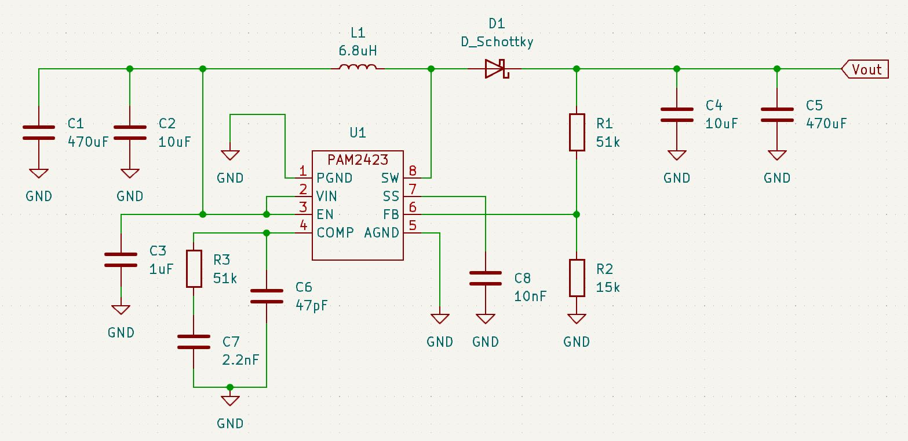

A photo of the constructed circuit is shown below:

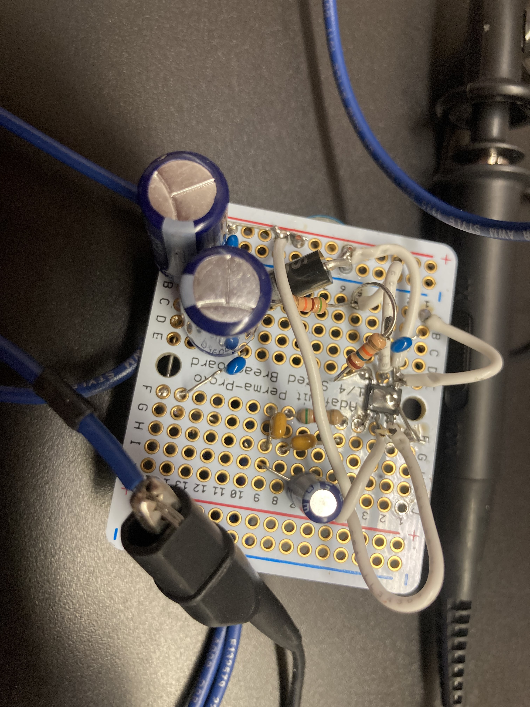

At no point during testing were any of the components hot to touch. 

The results are as follows:

 - $V_{in} = 4.20V$: $V_{out}$ = 5.38V
 - $V_{in} = 4.00V$: $V_{out}$ = 5.38V
 - $V_{in} = 3.80V$: $V_{out}$ = 5.38V
 - $V_{in} = 3.60V$: $V_{out}$ = 5.38V
 - $V_{in} = 3.40V$: $V_{out}$ = 5.37V
 - $V_{in} = 3.20V$: $V_{out}$ = 5.08V
 - $V_{in} = 3.00V$: $V_{out}$ = 4.57V
 - $V_{in} = 2.80V$: $V_{out}$ = 3.97V

This indicates that the boost converter will be more or less unable to support the circuit at around 3Vin - 3.2Vin. The RPi Pico should be alright with an upper $V_{in}$ of 5.38V as the datasheet claims it can run off 1.8V to 5.5V.

### Wand Rebuild

The wand has been rebuilt in its 15 LED form on a light, flexible fiberglass rod. This allows it to be waved much faster and more easily than previously. However, the results are still extremely unsatisfactory. In a well lit room, the POV effect is not strong enough for onlookers to make out what is being spelled. The same goes for video recordings of the effect. It still needs to be tested in a dark room, however.

## 2024/03/09

### Component Selection for the S-82K1B battery protection IC

On the S-82K1BAM-I6T1U datasheet, page 22, an example is shown. In the example, two N-Channel MOSFETs are used: One for overvoltage circuit disconnect, one for undervoltage circuit disconnect. Additionally, there are three resistors. R1 forms a low-pass filter with C1 across the battery and VDD and VSS terminals of the the chip. R3 connects VSS and INI on the chip, and R2 connects VM to the minus rail of the output.

#### R1 (Power fluctuation prot.)

The datasheet recommends a typical value of $330\Omega$, which we will use

#### C1 (Power fluctuation prot.)

The datasheet recommends a typical value of $0.1\mu F$, which we will use

#### R2 (Reverse voltage prot.)

The datasheet recommends a typical value of $470\Omega$, which we will use

#### R3 (Overcurrent detection)

The datasheet does not explain the value selection for this component, but recommends a typical value of $1.5m\Omega$. On digikey, such resistors are under a dollar each. 

#### MOSFETS

According to the datasheet, the MOSFETS should have a threshold voltage that is less than or equal to the overdischarge protection voltage. We are using the S-82K1BAM-I6T1U, which has an overdischarge detection voltage of 2.300V.

The [SI3900DV-T1-E3](https://www.digikey.com/en/products/detail/vishay-siliconix/SI3900DV-T1-E3/1656399) ([datasheet](ttps://www.vishay.com/docs/71178/si3900dv.pdf)) seems like a good choice for the mosfets. Relatively hand solderable at 1mm pitch, $0.7 a piece, with $V_{GS(th)} = 0.6V$ to $1.5V$. In worst case conditions they can handle continuous $I_{DS} = 1.8A$, and since only 15 LEDS are being used at this stage of the design, that is more than enough current capacity.

## 2024/03/18

### PCB - Pico or RP2040?

There is a decision to be made on whether the rpi pico should be soldered directly onto the PCB, or whether an RP2040 should be pick-and-placed onto the PCB instead.

#### Hand soldering the pico:
 - ~$5
 - larger space requirement
 - hand solderable
 - convenient

#### Pick-and-place assembly and RP2040:
 - pick-and-place would already be helpful for the battery protection IC and other small components
 - would result in a smaller, more professional final design
 - may be cheaper

#### Decision

In order to reduce complexity of the design, avoiding potential unexpected roadblocks, the RPi pico will be soldered directly on the board. The battery protection IC can be stenciled on using tweezers and solder paste.

[This helpful KiCad library](https://github.com/ncarandini/KiCad-RP-Pico) for the Pico will be used in the PCB layout. 

## 2024/03/19

### Boost Converter Testing

The boost converter has not yet been tested under load. Now is the time to do so. 

Initially, the output voltage would read as 5V and then immediately drop down to around 4V when measured with the multimeter, which is very bad. However, upon inspecting the circuit, it was noticed that the wire connecting pin EN to pin VIN of the PAM2423 was broken. Fixing this issue made the boost converter perform as expected when measured by the oscilloscope. However, when powering the RPi Pico and LED lights, things seem off. The system powers on just fine when powered through the boost converter, but the RPi Pico voltage is measured to be 3.3V, when it should be at least 5V. Additionally, the system powers on correctly when connected directly to the battery, at which point the system reads 4.2V.

 - Fully charged battery, no boost converter: VSYS = 4.2V. 	 System works.
 - Fully charged battery, with boost converter: VSYS = 3.3V. System works.
 - Med charge battery, no boost converter: VSYS = 3.86V. 	 System works.
 - Med charge battery, with boost converter: VSYS = 3.47V.	 System works.
 - Low charge vattery, no boost converter: VSYS = 3.6V. IBatt = 0.19A.  System barely works, all leds noticibly dim. 
 - Low charge vattery, with boost converter: VSYS = 3.292V. IBatt = 0.17A.  System barely works, all leds noticibly dim. 

Neither the boost converter nor the system power are behaving as I expected them to. Not only does the boost converter appear to actually introduce a votlage drop instead of a votage rise when under load, but the system works just fine without the boost converter regardless. However, based on the fact that the system starts to break down at around 3.6VBatt, an actually functional boost converter would likely be beneficial. Therefore, I plan to evaluate and then re-design the boost converter.

### Boost Converter - Why didn't it work?

Here is the circuit schematic of the boost converter: 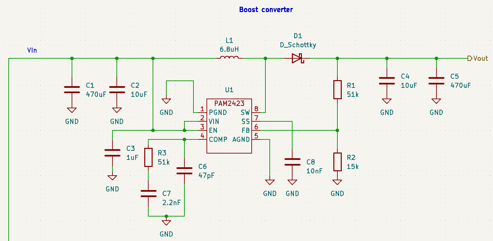
And here's a view of the oscilloscope monitoring the boost converter while it powers the system off of a single battery: 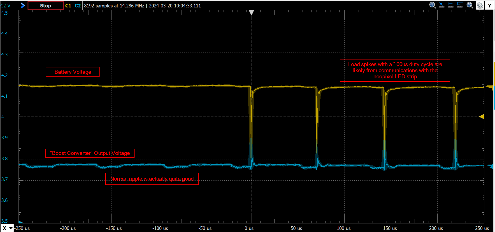

The image shows, once more, that when under load the boost converter just adds a voltage drop and some ripple, although the ripple isn't particularly bad in this case. Additionally, some spikes can be seen from when the system sends communications to the LEDs. Unfortunately, this doesn't explain why it doesn't work.

Possible issues:

 - The PAM232 chip cannot actually handle the load
 - The inductor is undersized
 - The capacitors are undersized
 - The diode has some mismatched spec I am unaware of

Now, I could spend a few hours reading literature and taking measurements to try and figure out what went wrong, OR I could use the TI boost converter designer tool to make sure that the next iteration actually works. Notably, we do not need to design for a 2A continuous load anymore, as half the LED's are being used at this point. Therefore, a boost converter designed for a ~0.6+A continuous load will be well within spec.

### Boost Converter - new design

According to some back of the napkin calculculations, the [TLV61070ADBVR](https://www.digikey.com/en/products/detail/texas-instruments/TLV61070ADBVR/16982069?s=N4IgTCBcDaIAQBUAyA1AbARgAwHYsEEQBdAXyA) should be more than capable of handling our load.

Those calculations are:

$$I_{OUT(CL)} = (1 - D) * (I_{LIM} + \frac{1}{2}\Delta I_{L(P-P)})$$
$$D = 1 - \frac{V_{IN} * 0.9}{V_{OUT}} = 0.46$$
$$\Delta I_{L(P-P)} = \frac{V_{IN} * D}{L * f_{SW}}$$

Where $V_{IN} = 3V$ (minimum), $V_{OUT} = 5V$, $f_{SW} = 1MHz$, $I_{LIM} = 2A$ and $L = 2.2\mu H$ (from datasheet: should be between 2.2 and 4.7, lower seems to grant better results).

The results are: $I_{OUT(CL)} = 1.25A$ of continuous load current! This is more than double the required current.

The example circuit is shown below:

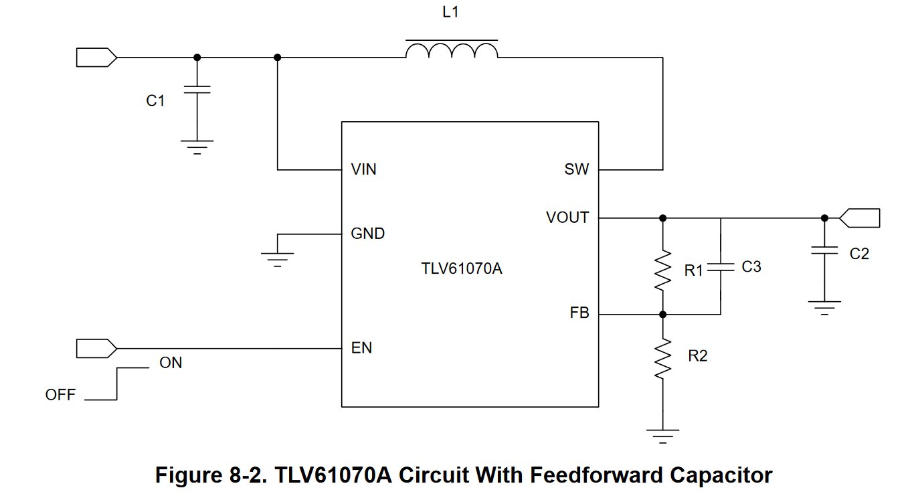

#### Inductor selection

The datasheet recommends the $2.2\mu H$ part [74438357022](https://www.digikey.com/en/products/detail/w%C3%BCrth-elektronik/74438357022/6833539?s=N4IgTCBcDaIOwBYEGYAcyCscAMYIF0BfIA)

$I_{L(DC)} = \frac{V_{OUT} * I_{OUT}}{V_{IN} * \eta} = 1.11A $  

$\Delta I_{L(P-P)} = \frac{V_{IN} * D}{L * f_{SW}} = 0.63A$

$I_{L(P)} = I_{L(DC)} + \frac{\Delta I_{L(P-P)}}{2} = 1.43A$


#### Output Capacitor Selection

The absolute minimum value of the output capacitor is selected by:

$V_{RIPPLE(ESR)} = I_{L(P)} * R_{ESR} = 0.056$

$C_{OUT} = \frac{I_{OUT} * D_{MAX}}{f_{SW} * V_{RIPPLE}} = 6.6\mu F$. We can give plenty of space for this by selecting a $47\mu F $ capacitor

Part: [865080543009](https://www.digikey.com/en/products/detail/w%C3%BCrth-elektronik/865080543009/5728103)

#### Resistor selection

The resistors can be selected by the following equation:

$R_1 = (\frac{V_{OUT}}{V_{REF}}-1) * R_2$

where $V_{REF}$ is the internal reference of the chip, $V_{REF} = 0.5V$. The lower $R_2$ is, the less noise there is, and the more quiescent current is wasted. $R_2$ should be below 100k.

By selecting $R_2 = 20k$, we get $R_1 = 180k$. These are both common series 24 resistor values!

#### Loop Stability, Feedforward Capacitor Selection

The feedforward cap is selected by:

$C_3 = \frac{1}{2 * \pi * f_{FFZ} * R_1} = 884pF$

The closest reasonable capacitor value is $C_3 = 820pF$

#### Input Capacitor Selection

The datasheet recommends $C_1 = 10\mu F$

## 2024/03/21

### Power draw test

By powering the 15 LED wand at full brightness (rgb(255, 255, 255)) with a RIGOL DP832 programmable power supply, the power draw is measured.

- At 5.4V, with all led's set to full-bright white, the system draws 5.41V * 0.52A = 2.8W
- At 5V, with all led's set to full-bright white, the system draws 5V * 0.52A = 2.6W
- At 3V, with all led's set to full-bright white, the system draws 3V * 0.28A = 0.84W

Notably, at 5.4V and at 5V the system draws the same current, so it is unlikely that the LED's are any brighter when pushed beyond 5V.

When it comes to low brightness (rgb(1, 1, 1)) the results are unsurprising:

- At 5.4V, with all led's set to min-bright white, the system draws 5.41V * 0.02A = 0.11W
- At 5V, with all led's set to min-bright white, the system draws 5V * 0.03A = 0.15W
- At 3V, with all led's set to min-bright white, the system draws 3V * 0.03A = 0.09W

## 2024/03/25

### PCB ordering

Total component price for the PCB with battery protection: 	$23.36

Total component price for the PCB without battery protection:	$19.86

So, keeping in battery protection increases unit price by $3.50. 

This is not including the price for physical materials, like a 3D printed case or a rod for the led strips to mount to. It also excludes the unit price of the 18650 batteries and their holders. The batteries were $7.49 each, and the holders were $0.83 each. Assuming an additional $5 for physical materials (PCB, dowel), the total unit price for each wand is ~$33.17

## 2024/05/26

### Revisiting wand position

After watching this video [Simple pendulum animation](https://www.youtube.com/watch?v=cekU-08YQj0) I thought of an idea for a new method for finding the direction change points in the swing. While it is true that the peak acceleration magnitude occurs at the ends of each swing, like the video demonstrates, in practice I have found that since the exact peak value is never the same for each swing, the direction change detection can be finniky. So, instead testing if the acceleration of the wand has crossed a certain prerecorded peak value, the jerk of the wand could be recorded and then simply tested if it is greater than or less than 0. That would also allow the jerk of the wand to be treated like a direction of travel.

In practice, this did not work out. The system's framerate may be too slow due to the main loop being blocked by LED communications each frame. This should be investigated

## 2024/05/27

### LED reselection

After a meeting with the client, it became apparent that the wand is simply not bright enough. In order to make this less of an issue, we will switch to the (Adafruit NeoPixel Digital RGBW LED Strip)[https://www.adafruit.com/product/2832]. This will increase the current draw of the system, but also make it much brighter. Unfortunately, this means redesigning the boost converter once more to accomodate 1.2A minimum continuous draw.

### Boost Converter Redesign

Following [Basic Calculation of a Boost Converter's Power Stage](https://www.ti.com/lit/an/slva372d/slva372d.pdf?ts=1711545451132)

From the guide, "The first step to calculate the switch current is to determine the duty cycle, D, for the minimum input voltage. The
minimum input voltage is used because this leads to the maximum switch current" (2).

$D = 1 - \frac{V_{IN(min)} * \eta}{V_{OUT}}$

The current ripple:

$\Delta I_{L} = \frac{V_{IN(min)} * D}{f_S * L}$, where $f_S$ is the minimum switching frequency.

Finally, we can calculate the maximum output current of the boost converter:

$I_{MAXOUT} = (I_{SWLIM(min)} - \frac{\Delta I_L}{2}) * (1 - D)$

#### Boost Converter Selection

Based on the above calculations, it seems like [The TPS61033DRLR](https://www.digikey.com/en/products/detail/texas-instruments/TPS61033DRLR/18724278) is a good choice.

Unfortunately, the package is SOT-583, which is quite small, on par with the batter protection IC. Regardless, we will use this component. Note that we CANNOT use the TPS610333DRLR, as although it's output is fixed at 5V, the minimum switch current limit is 1.8A instead of 4.7A

An example circuit is given by TI below: 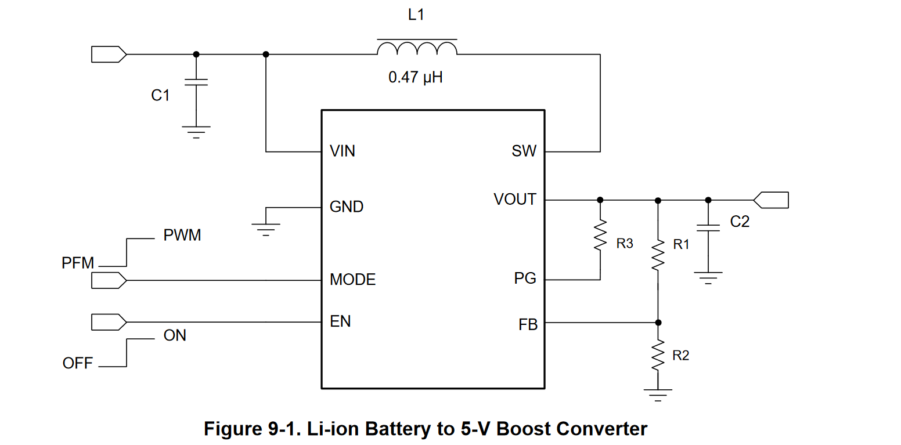

The PCB layout should mimic the layout example on page 21 of the [datasheet](https://www.ti.com/lit/ds/symlink/tps610333.pdf)

#### Setting the output voltage

The output voltage is set by a voltage divider on the FB pin of the chip. Resistor values can be selected by 

$R_1 = (\frac{V_{OUT}}{V_{REF}} - 1) * R_2$, where $V_{REF} = 600mV$ nominally. For best accuracy, keep $R_2 < 300k$

By this equation, we can find that ratio $R_1 / R_2 = 7.33$. A close match in resistor pairs is $R_2 = 15k$, $R_1 = 110k$. That gives an output voltage of almost exactly 5V.

The max current through the resistors will be $\frac{5V}{R_1 + R_2} = 40\mu A$. Therefore, the power requirements are very lenient for these resistors.

#### Inductor Selection

The datasheet recommends XGL4020-471MEC or XGL4020-102MEC. Since both are the same price and XGL4020-471MEC has a better specs, we could use the XGL4020-471MEC. However, the SRP7050TA-R47M has identitcal specs (inductance, SRF, better DCR, better Isat) except that the inductance was tested at 100kHz instead of 1MHz. Since this is only one order of magnitude off, and the SRF is still way above the operating frequency, it should be a sufficient value. 

#### Cap selection

A $10\mu F$ cap across the input is recommended. In addition, "If the input supply is located more than a few inches from the converter additional bulk capacitance may be required in addition to the ceramic bypass capacitors. A typical choice is a tantalum or
aluminum electrolytic capacitor with a value of 100 μF". Since our application will have the battery behind at least 3in of wire, we will need to add another cap.

Output cap: [JMK107ABJ106MA-T 10UF](https://www.digikey.com/en/products/detail/taiyo-yuden/JMK107ABJ106MA-T/4970720)

For 10uF, the output ripple is $V_{RIPPLE} = \frac{1.3A * .6}{2MHz * 10uF} = 39mV$ which is acceptable. Since the recommended layout shows two adjacent to each other on the datahseet, we will have two (this will theoretically halve the ripple anyway). 

#### PG pin and R3

According to the datasheet, "If not used, the PG pin can be left floating or connected to GND". Since PG seems optional, we will ground the pin

## 2024/04/01

After beginning work on a python tool to plot the accelerometer data in order to get a better model of the wand's position in space, I made the embarassing realisation that since I re-built the wand, the Z-axis is no longer the axis of motion for the wand. For the current prototype, the Y-axis should be used. For the current PCB design, the X-acis should be used. It may be prudent to add this as a compilation option in the CMakeLists.txt file.

### Accelerometer Data

After writing a new build target (accelerometer_data.uf2) and a script for communicating with it ([accelerometer_tests.py](../scripts/accelerometer_tests.py)), the accelerometer data can now be plotted. The image below shows the acceleration data as transmitted from the wand, the calculated jerk (laptop side) and the implied direction of the jerk for various averaging windows.

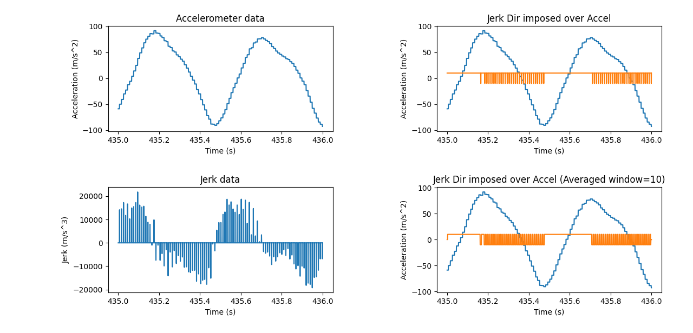

As can be easily seen in the plot, even though the jerk direction (its sign) generally follows the direction the wand is moving in, even when filtered by a moving average it is inconsistent and jumpy. A better solution might be to add hysteresis instead of averaging.

------------------

Actually, it appears that a large part of the problem was as follows: Originally, the direction of the wand was assumed to be negative if the jerk was less than zero, and positive otherwise. This introduces confusing jitter becase the calculated jerk is often exactly zero. Changing the code to hold its last direction in the case of jerk==0 produced the following plots:

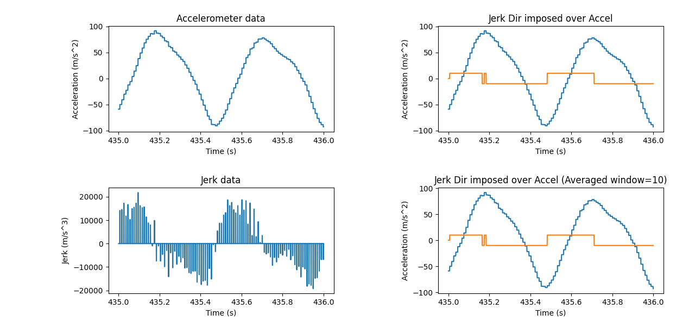

It is still apparent that windowing is not useful. By zooming in, it can be seen that the width and frequency of the innacuracies are identical, the windowing only introduces a delay. Still, this one change greatly improved the accuracy of the estimated direction.

Here is a better look at why hysteresis might help: When the wand is changing direction, the estimated direction often flickers back and forth:
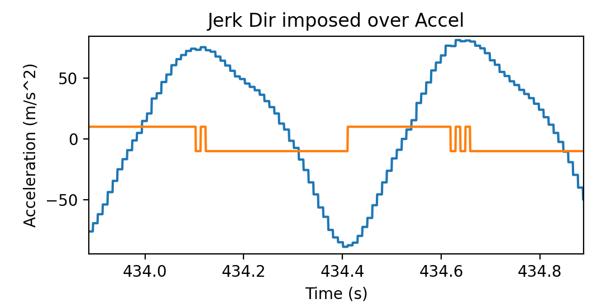

And now, observe how adding a hysteresis effect (only updating the direction of N previous samples agree) smooths out the direction calculations!

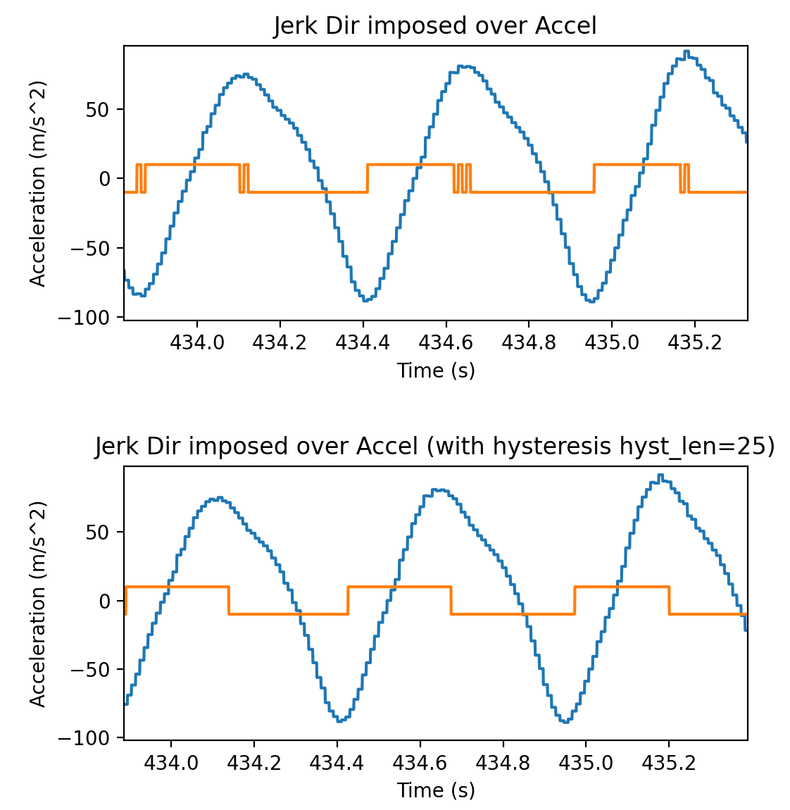

Now that we have a good method for finding the direction the wand travels in, the next step is to put it on the hardware! While in the plot, a hysteresis window of 25 samples was used, in the real case we can expect the main loop to run much slower than the data acquisition build target, so fewer samples will likely be used.

---------------------------

After implementing this new system on the wand and testing by lighting the wand red for left (dir = 0) and green for right (dir = 1), the wand direction appears to be very well characterized. The next step is to calculate the period of the wand's motion and update that every cycle.

## 2024/04/01
### Period calculation and keeping the image static

The current goal is to get the wand to display a vertical bar at the middle of its swing, and minimize the amount that bar moves from swing to swing. Initial testing shows that the average length of casual but firm one-handed swing is around .45 seconds, and around 350 iterations through the main while loop occur during this time.

Rick Eason recommended that the display be handled by clock division interrupt. Because this system is dual-core however, it may be better to simply have a separate while loop on core 1 that handles the LED display. By making put_15_pixels_on() and put_15_pixels() return the amount of microseconds slept during their run, we can simply wait $\frac{swinglen}{N_{updates}} - pixeltime$ microseconds every loop.

## 2024/04/04
### Debugging wand display

After implementing the period calculation using the method outlined above, the result is not exactly what one would want. It seems like the columns are almost never being finished in a swing. To get a closer look, I added a printf after each swing to find out how many columns were actually rendered in that swing.

Waving the wand as fast as possible with a two handed grip:
```
finished 123/256
finished 108/256
finished 124/256
finished 108/256
finished 154/256
finished 93/256
finished 108/256
finished 108/256
finished 139/256
finished 62/256
finished 154/256
finished 108/256
finished 139/256
finished 92/256
finished 108/256
```

Waving the wand at a good clip, one handed grip:
```
finished 256/256
finished 256/256
finished 255/256
finished 256/256
finished 256/256
finished 256/256
finished 256/256
finished 239/256
finished 256/256
finished 233/256
finished 256/256
finished 224/256
finished 256/256
finished 248/256
finished 256/256
finished 256/256
```

From this test, we can see that the software actually can't keep up with a two-handed swong. This might not be such a bad thing - waving the wand as fast as possible makes the weilder look rather silly, and also puts quite a bit of strain on the wrists. Hopefully, with brighter LED's the slower swing speed will be sufficient.

## 2024/04/07
### Case Design (3D print)

In order to house the electronics and make a grip for the user to hold the wand, a 3D printed case and/or handle should be designed. There are two main options here:

1. Combined case/handle

	- \+ sleeker design
	- \+ only one part needs to be printed
	- \- much more complicated design
	- \- more difficult to print
	- \- more problematic if not physically strong enough

2. Separate electronics case (mounted on rod behind leds) and handle (mounted at base of rod)

	- \+ much simpler design
	- \+ much less likely for handle to snap
	- \- clunkier look
	- \- more parts to be printed

After a bit of thought, it seems like option 2 is the better choice for now. It is likely that I would fail to create an adequate design if I went with option 1.

#### Shaft parameters

The shaft should be a wooden dowel that is thick enough and sturdy enough to both have parts mounted to it, and withstand being waved back and forth at a high speed.

- Length requirements: Minimum 10cm, 3.9in (handle) + 52cm, 20.5in  (led strip). Lets call it 65cm, 25.5in for safety's sake

- Selected component: [Madison Mill 0.5-in dia x 24-in L Square Oak Dowel (12-Pack)](https://www.lowes.com/pd/Madison-Mill-1-2-x-24-Oak-Square-12-PKG/5001880827)

	- Shape: rectangular prism
	- Width/Height: 1.27cm
	- Length: 60.96cm

#### Handle parameters

The handle should be able to comfortably fit one adult hand.

- External Shape: ~Cylinder 
- Diameter: ~3.5cm
- Length: 10+cm
- Shaft slot shape: rectangle
- Shaft slot diameter: 1.27cm
- Attachment mechanism: Wood screw + glue

#### Case parameters

The case needs to house the rocker switch, populated PCB, and battery holder. The battery should be accessible for swapping. Because the electronics no longer need to be contained within the handle of the wand, it may actually be wise to not cover them - instead of designing a complete case, merely design a platform for the PCB and battery to mount on, and make it easy to mount to the shaft. For that matter, if wooden dowels are used the battery holders can be attached separately from the PCB+switch using a single wood screw and glue. The batteries are held in extremely tight by the holders - to remove them, a prybar is often needed. This means we can safely assume that the batteries will not fly off when the wand is waved.

- PCB Width: 30.48mm
- PCB Height: 95.25mm
- PCB thickness: 1.6mm
- PCB holder arms overhang max (top half): 1.4mm (oops!!)
- PCB holder arms overhang max (pico half): 3.3mm (okay)

#### Screws

Currently, the plan is to devote two screws per wand. The selected screws are the following product: [Hillman #2 x 1/4-in Brass Interior Wood Screws (12-Per Box)](https://www.lowes.com/pd/Hillman-2-x-1-4-in-Gold-Brass-Round-Interior-Exterior-Wood-Screws-12-Count/3011870). They have a shaft diameter of 2mm and a length of 6.4mm

## 2024/04/08

While it is an educationally enriching experience to learn to model and print 3D parts for this project, the requirement for a PCB mount could have, in hindsight, been completely avoided by simply having mounting holes on the PCB and screwing them straight into the dowel. If this project is continued after version 1, that will be one of the changes.

## 2024/04/10

RGBW leds are now functional. After testing, my eyes hurt and have after image spots as if I had looked at the sun. This means that the wand is probably bright enough now.

---------------------

While testing the wand at the UMaine hacekrspace, a group of people operating a radio picked up some pretty intense radio interference from the wand, that sounded pretty musical.

## 2024/04/14

Handle 3D model design:

The handle has been designed to house the rocker switch. 75% of the height of the handle contains 75mm of the dowel shaft. For stability, two 1in screws will be drilled through the handle. The model contains no holes for these screws other than small sinks for the heads, as the current plan is to simply drill a guide and then screw them in. This simplifies the print and makes it less likely to fail.

-----------------------

After printing, the overall design appears to be a success. However, the tolerances on the switch port were slightly too tight to allow the switch to be snapped in, and the tolerances on the dowel shaft were also too tight. That was able to be pounted in with a mallet, so it's not a big issue. The switch _is_ an issue though. The diameter of the sketch for it likely needs to be widened by 2mm.

As for the screws that anchor the handle to the dowel, I purchased #8x1in metal sheet screws. These seem like they will work. However, the holes for the screws need to be drilled to the correct diameter.

## 2024/04/18

Further handle 3D model edits: The second print works well with the switches, perhaps even being slightly looser than it needs to now. However, it was printed at a very high infill, and now it is nearly impossible to pound the wooden dowel into the handle shaft. Widening this shaft by at least a millimeter will likely be very helpful, although going up to two millimeters may be viable as there will be two screws holding the shaft in place as well as friction.

----------------
In the end, it has been decided to make the shaft wider by 2cm.

## 2024/04/23

The printed circuit boards have arrived for the project, and a first attempt at soldering the surface mount components has been made. Solder paste was scraped onto the PCB, the components were plalced with tweezers, and then the PCB was baked in a toaster oven. The result is pictured below:

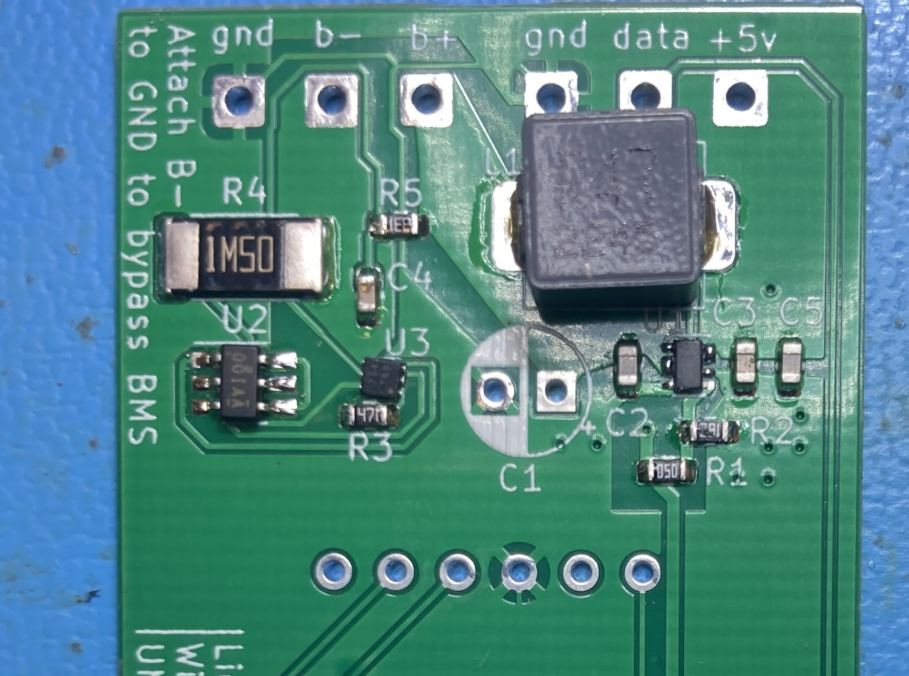

It may be difficult to see in the image, but U3 is askew, and U1 has bridged solder joints. In order to fix them, we need to know if it is safe to use a hot air gun on these components. The solder paste used is the SMD291AX500T3, which has a melting point of 183C.

- U1, the TPS61033: MSL rating Level-1-260C-UNLIM, means the IC can handle a peak reflow temperature of 260 degrees. It is safe to fix this component.
- U3, the S82K1B: If the rating is listed on the datasheet, it is in chinese.

---------------------------

While the reflow was likely successful, it turns out that U1 was actually rotated 180 degrees. Instead of trying to fix the orientation again, a new pcb was populated, this time only with the boost converter circuit and through-hole components. Amazingly, the boost converter works!

## 2024/04/23

Now that a working PCB is assembled, the executables requesting accelerometer data from the ADX343 have been updated to use the correct axis.

## 2024/04/28

Updated the alphabet generation code so that empty space behind the characters can be blank. The wand is now fully legible even in a lit room!